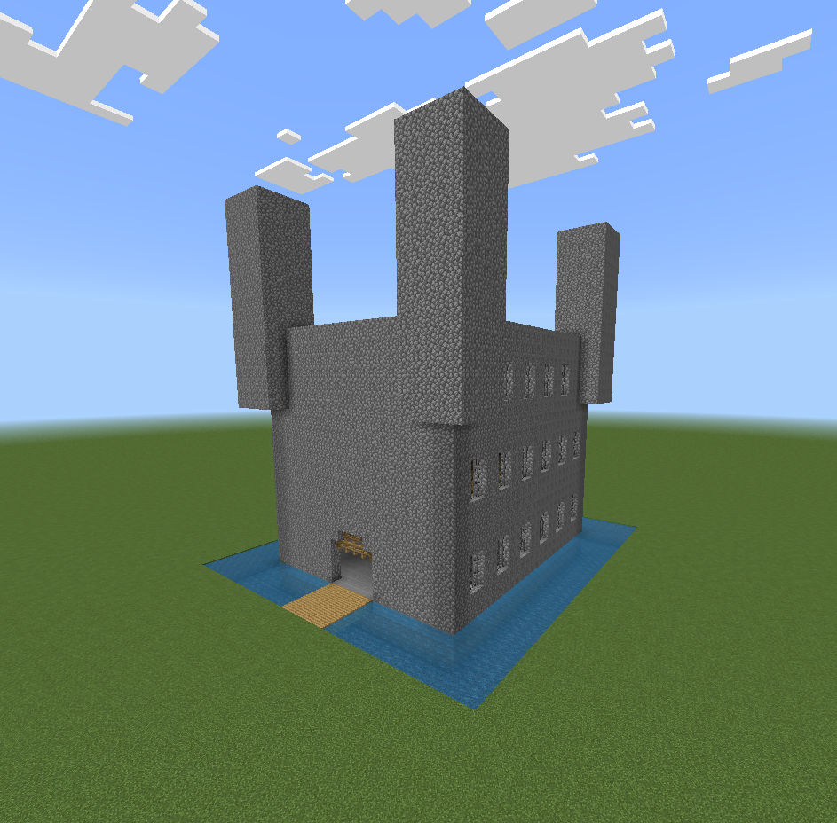

# MINECRAFT CASTLE BUILDER ADD-ON



## Setup

Docker:
```pwsh
docker build -t minecraft-builder .
docker run --rm -v "${env:APPDATA}\Minecraft Bedrock\Users\Shared\games\com.mojang\development_behavior_packs\CastleScript:/out" minecraft-builder
```

Windows:
```pwsh
npm install
npm install --save-dev nodemon shx
npm run watch
```

## Using in-game
Type
```
!castle [width] [length] [floors]
```
to run the script.